<div align="center">

<!-- ── README BACKGROUND ─────────────────────────────────────── -->

<div style="background-image: url('./assets/ayush_das_readme_background.svg'); background-size: cover; background-position: center top; background-repeat: no-repeat;">

<!-- ── ANIMATED HEADER ────────────────────────────────────────── -->



<br/>

[](https://git.io/typing-svg)

<br/>


&ensp;
<a href="https://github.com/ayushdas27?tab=followers"></a>
&ensp;


</div>

<br/>

<!-- ── ABOUT ─────────────────────────────────────────────────── -->

<table width="100%" style="border-collapse: collapse; border: 1px solid #1e293b; border-radius: 12px; overflow: hidden; background: #060b13;">
<tr>
<td width="65%" valign="top" style="padding: 24px; font-family: 'JetBrains Mono', 'Fira Code', monospace;">

```typescript
const ayush = {
    pronouns    : "he" as const,
    title       : "B.Tech CSE (AI/ML) · DPS Siliguri Alumnus",
    stack       : ["Python", "C", "TypeScript", "MySQL"],
    projects    : {
        urbanSight : "AI-powered urban intelligence — CV + geospatial",
        lunarAlign : "Chandrayaan-2 lunar image correspondence system",
        quantam    : "Smart digital procurement platform",
    },
    achievements: [
        "Smart India Hackathon · AI/ML",
        "Cybersecurity Workshop",
        "AI-Driven NLP Workshop",
    ],
    motto       : "Minimal. Chill. Shipping anyway. ⚡",
    openTo      : ["collabs", "internships", "interesting problems"],
} as const;
